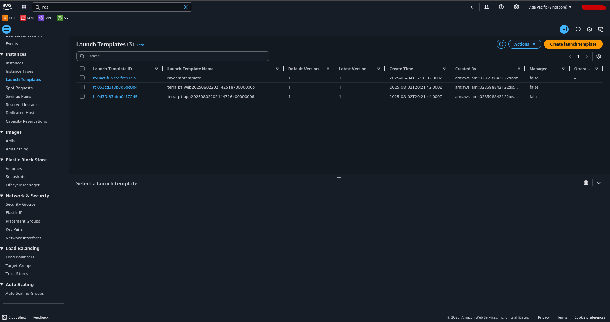
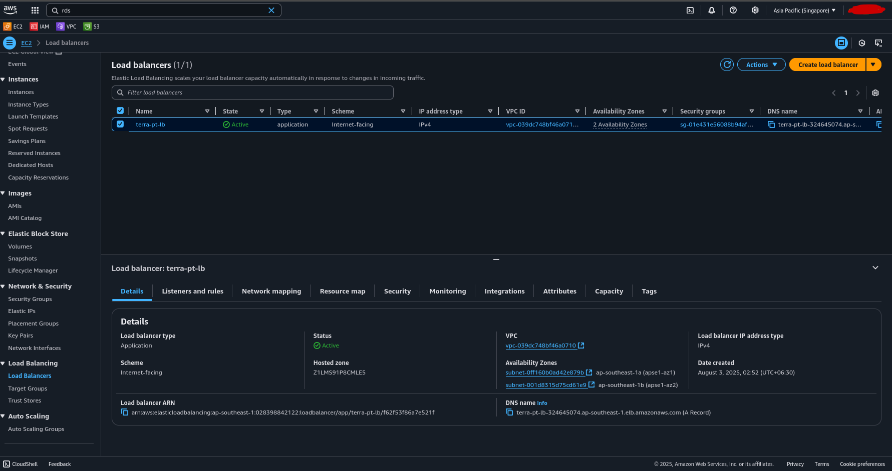
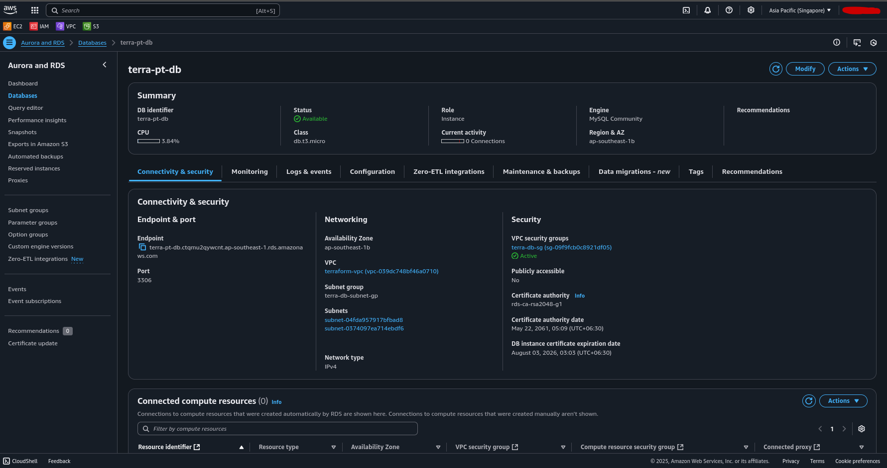
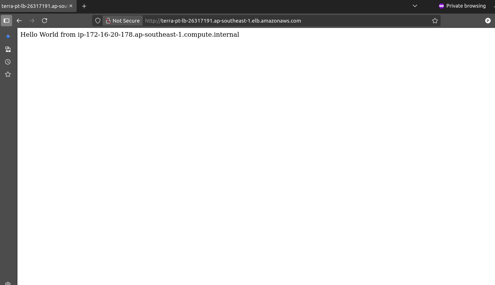

# Three tier architecture on AWS using Terraform

## Prerequisites
- AWS IAM account with root privileges.
- Need to installed terraform on your local pc.

### Project structure
```
.
├── main.tf
├── module
│   ├── compute
│   │   ├── app.sh
│   │   ├── data-ami.tf
│   │   ├── main.tf
│   │   ├── output.tf
│   │   ├── variable.tf
│   │   └── web.sh
│   ├── db
│   │   ├── main.tf
│   │   ├── output.tf
│   │   └── variable.tf
│   ├── lb
│   │   ├── main.tf
│   │   ├── output.tf
│   │   └── variable.tf
│   └── network
│       ├── main.tf
│       ├── output.tf
│       ├── sg.tf
│       └── variable.tf
├── output.tf
├── provider.tf
├── README.md
└── variable.tf
```

### Steps
Follow these instructions to deply 3 tier architecture on aws using terraform.

1. Open terminal
2. Setup your AWS IAM user using aws cli
```
aws configure
```
3. Clone this repo
```
https://github.com/paingthu555/terraform-threetier-archi-aws.git
```
4. Change to the project directory
```
cd terraform-threetier-archi-aws
```
5. Initialize terraform 
```
terraform init
```
6. Check code syntax
``` 
terraform validate
```
7. Terraform code dry-run
```
terraform plan
```
8. Deploy the infrastructure
```
terraform apply --auto-approved
```

### Verifying the three tier infrastructure
- After deployment completed, copy the ALB DNS name output and paste it into your browser.

### Destroy infrastructure
- If you want to remove the infra, run;
```
terraform destroy --auto-approved
```

## Confirm the infrastructure







